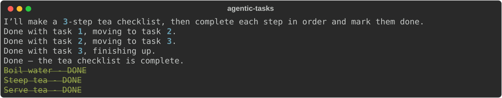

# agentic-tasks

> 🚧 **Work in progress.** The core loop runs end-to-end, but the demo is still rough around the edges.

A small demonstration of how AI agents plan work: the agent breaks a goal into a **checklist of tasks** and then **updates that checklist through tool calls** as it completes each step, rendered live in the terminal.

## Demo

Given the prompt *"Make a checklist to brew a cup of tea (3 short steps), then complete every step in order using the tools"*, the agent plans, narrates progress, and checks off each task as it goes:



## Idea

1. The agent receives a goal from the user.
2. It calls `define_checklist` to lay out the tasks it plans to do.
3. As it finishes each task, it calls `update_checklist` to mark it done.
4. The terminal shows the checklist updating live (via [Rich](https://github.com/Textualize/rich)).

## Project layout

- `src/tools.py`: checklist state, the tool functions, their JSON tool schemas, and the terminal rendering
- `src/api.py`: the OpenAI chat loop — sends the conversation, dispatches tool calls, feeds results back until the model is done
- `src/main.py`: entry point — reads a prompt from the user and runs the agent loop live

## Status

- [x] Tool schemas for `define_checklist` and `update_checklist`
- [x] Live checklist rendering with Rich
- [x] LLM wired up (OpenAI, tool calling)
- [x] Agent loop that executes tasks and reports progress
- [ ] Error handling (bad tool args, API failures, empty checklist)
- [ ] Support for more than one checklist per session

## Running

Requires Python 3.12+, [uv](https://github.com/astral-sh/uv), and an OpenAI API key.

1. Add your key to a `.env` file in the project root:
   ```
   OPENAI_API_KEY=sk-...
   ```
2. Install dependencies and run:
   ```bash
   uv sync
   uv run src/main.py
   ```
3. Enter a multi-step goal at the `User:` prompt and watch the checklist get planned and completed live.
